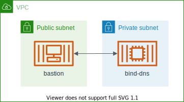
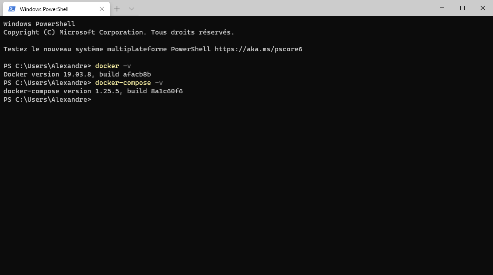
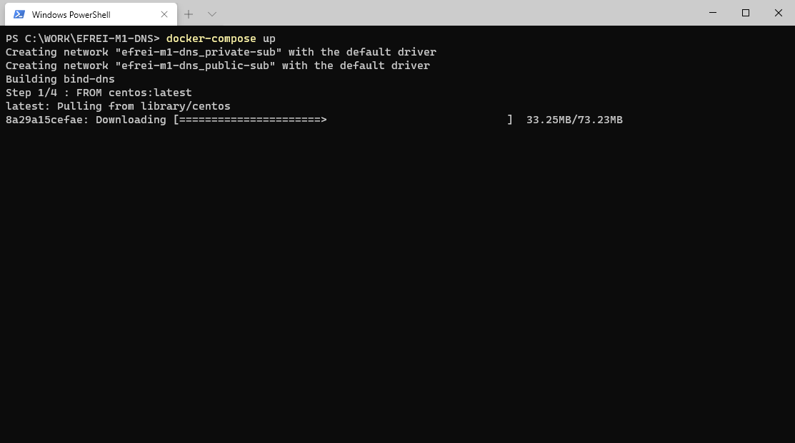
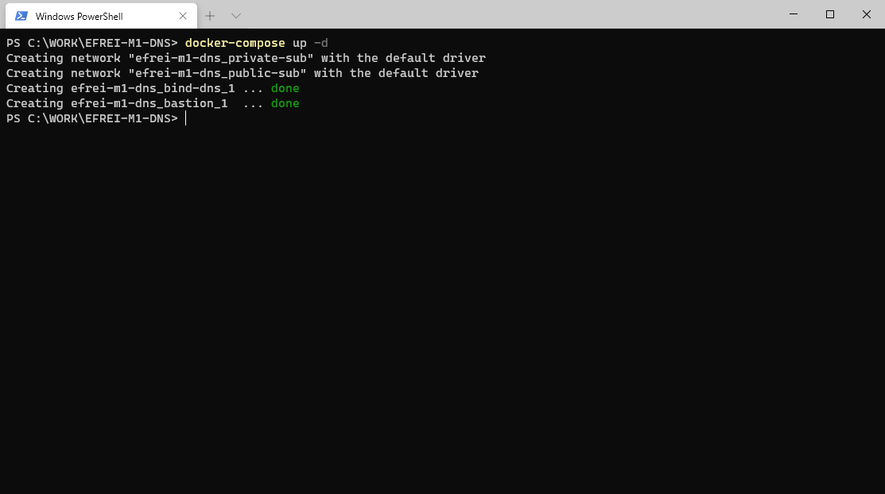
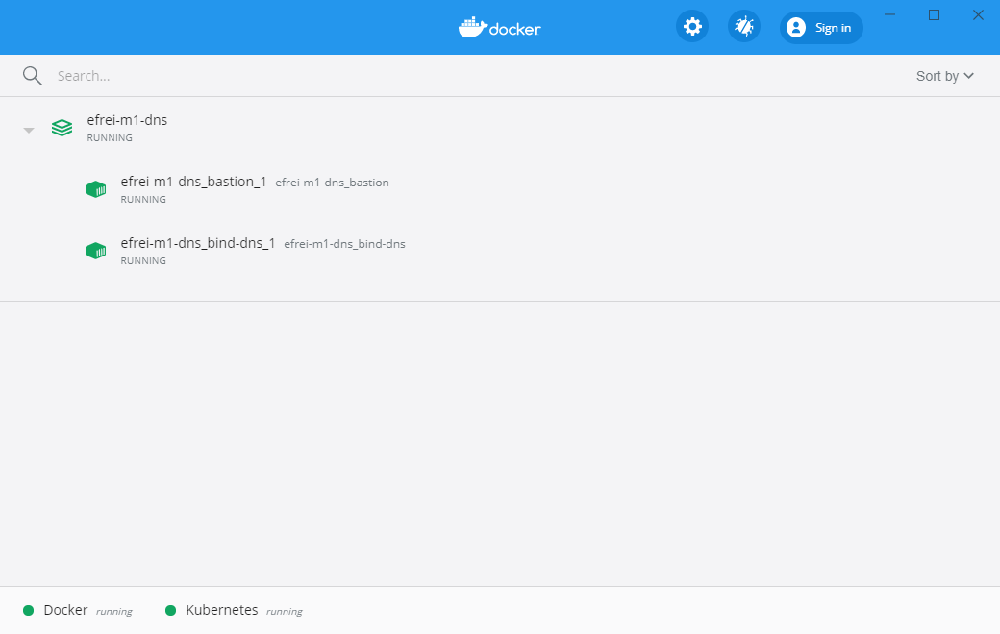
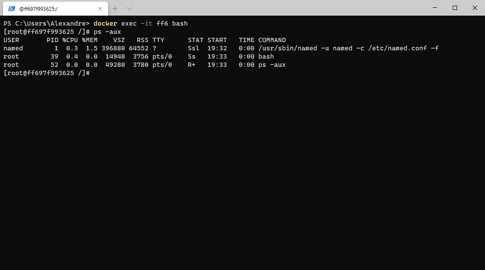
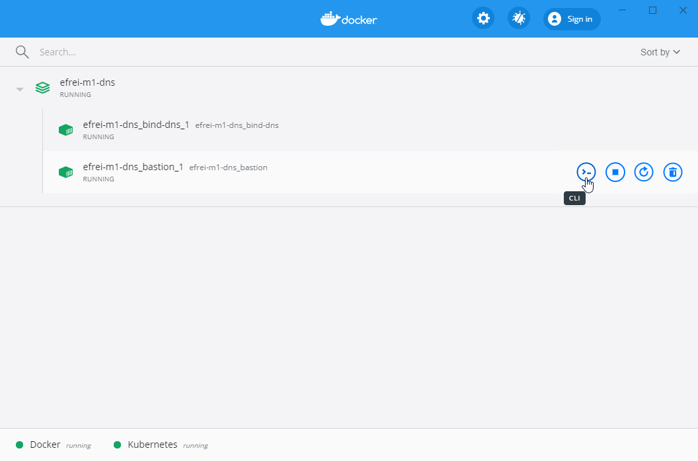
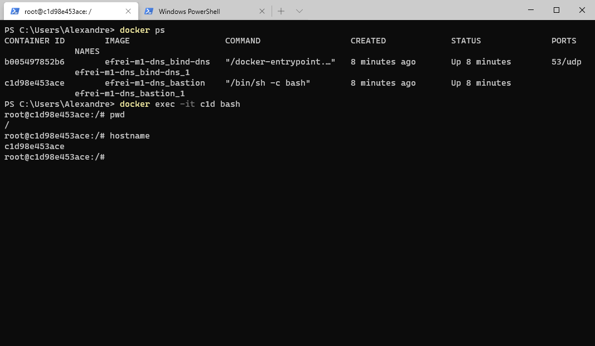
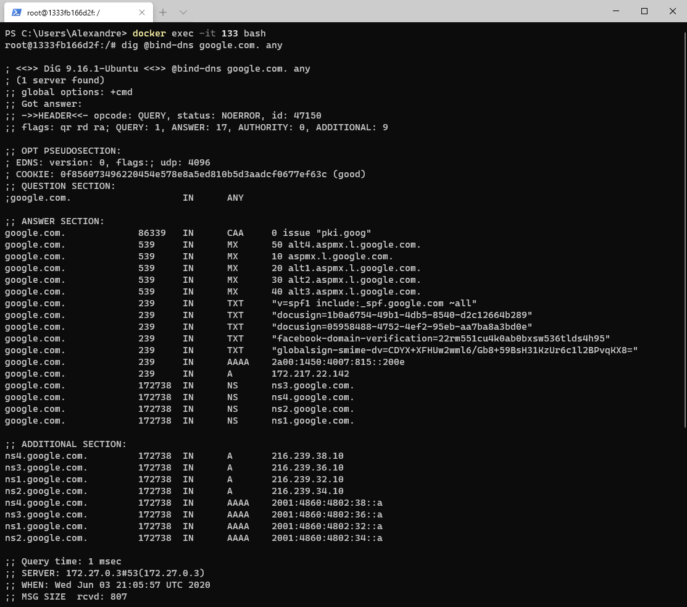

# EFREI M1 DNS
> Provided a CentOS based dns server with a bastion client to test dns queries



## Prerequisites
> To play with this config, you must have docker installed and the docker-compose CLI > 3.8 installed



## Installation
> To install this project you just have to type the following command on your dev environment

```bash
docker-compose up -d
```

On the first launch the docker engine will download and build all required images for our containers, this can takes severals seconds:



Or if you already have images for our solution the deployment will takes less than 5 seconds !



You can always check if the containers are running by opening the Docker Dashboard:




We can check if the service is running by checking the list of process using the `ps -aux` command:


## Test & learn
> You will have to connect to the bastion container to makes test

To connect directly to the bastion, just open the Docker Dashboard and click on the `CLI` button for the bastion container



Or you can use the `docker exec` command to open a terminal (you will need the container id)


And finally you can types your commands in the shell:
```bash
dig @bind-dns google.com. any
```

