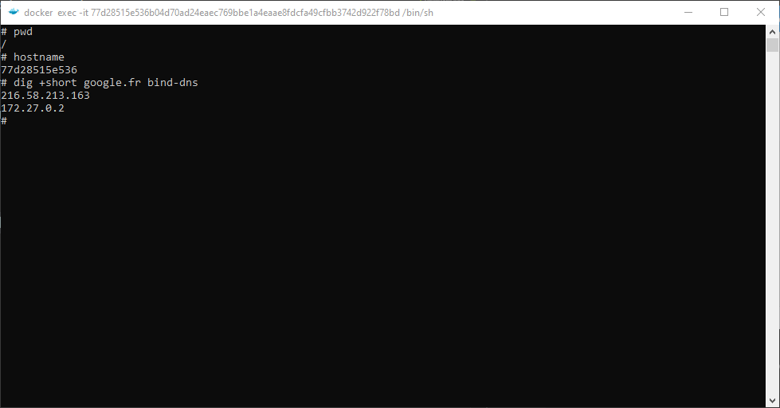

# EFREI M1 DNS
> Provided a CentOS based dns server with a bastion client to test dns queries


## Prerequisites
> To play with this config, you must have docker installed and the docker-compose CLI > 3.8 installed


## Installation
> To install this project you just have to type the following command on your dev environment

```bash
docker-compose up -d
```

On the first launch the docker engine will download and build all required images for our containers, this can takes severals seconds:


Or if you already have images for our solution the deployment will takes less than 5 seconds !


You can always check if the containers are running by opening the Docker Dashboard:


## Test & learn
> You will have to connect to the bastion container to makes test

To connect directly to the bastion, just open the Docker Dashboard and click on the `CLI` button for the bastion container


And finally you can types your commands in the shell:



```
dig +short pares-donadei.com bind-dns
```